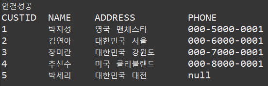

### customMember
#### main
```
public class CBasic {
	public static void main(String[] args) {
		new CustomManager().run();
	}
}

```
#### CustomManager().run()
```
public class CustomManager {
	void run() {
		CustomList cl = new CustomList(); // cl에 CustomList연결
		cl.connect();   // DB연결한다.
		cl.selectManagerList(); // Select문으로 CustomerList를 불러온다.
        // CustomList 안에 custom객체배열 하나하나에 printCustomer 실행한다.
		for( int i=0 ; i<cl.custom.length ; i++ ) {
			cl.custom[i].printCustomer();
		}
		cl.closeDB(); // DB를 닫는다.
	}
}
```
#### CustomList
```
public class CustomList {
	Custom custom[];
	
	Connection con=null;
	Statement stmt;
	ResultSet rs;
	
	public void connect() {
		String url = "jdbc:oracle:thin:@localhost:1521:xe";
		String userid = "madang";
		String pwd = "madang";	
		try {
			Class.forName("oracle.jdbc.driver.OracleDriver");
			con=DriverManager.getConnection(url,userid,pwd);
			System.out.println("연결성공");
		} catch (Exception e) {
			e.printStackTrace();
		}
	}
	
	public CustomList() { // 생성자 이므로 CustomManager().run()의 CustomList cl = new CustomList(); 실행과 동시에 이 코드는 실행된다.
		custom = new Custom[5]; // 객체배열 몇 줄 만들지 선언
		for ( int i=0 ; i<custom.length ; i++ ) { // 각 줄마다 Custom() 생성자 집어넣음
			custom[i] = new Custom();
		}
			
	}
	
	public void selectManagerList() {
		String query = "SELECT * FROM customer";
		try {
			stmt = con.createStatement();
			rs=stmt.executeQuery(query);
			System.out.println("CUSTID \tNAME \tADDRESS \tPHONE");

			int index=0;
			while (rs.next()) 
			{
				custom[index].setCustid(rs.getInt(1));
				custom[index].setName(rs.getString(2));
				custom[index].setAddress(rs.getString(3));
				custom[index].setPhone(rs.getString(4));
				index++;
			}
		} catch (Exception e) {			
			e.printStackTrace();
		}
	}
	
	public void closeDB()
	{
		try {
			con.close();
		} 
		catch (SQLException e) 
		{
			e.printStackTrace();
		}
	}

}
```
#### 실행 결과 화면
