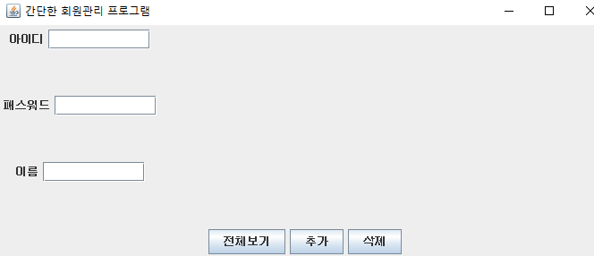
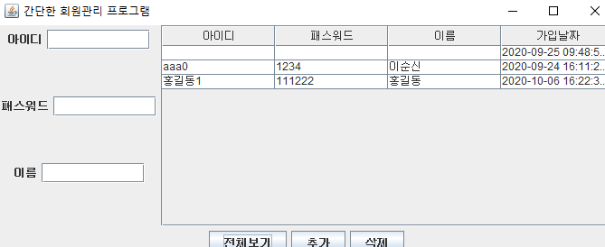
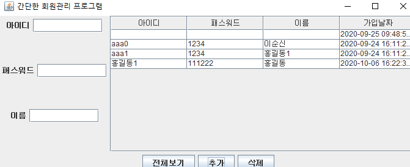
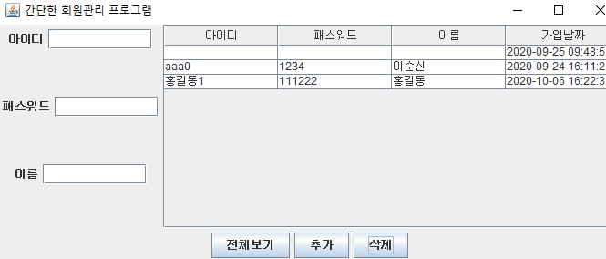

### MemberManager 실행화면

### MemberManager.java - showAllMembers()
#### 1. getVectorFromList객체로 부터 List를 받아 2차원 vector datas에 넘긴다.
#### 2. vector객체로 columnNames을 받아와 태그제목을 만든다.
```
void showAllMembers() {
		// List 구현체 종류 : ArrayList, Vector

		// DB로부터 데이터를 List로 조회
		List<MemberVo> list = memberDao.getAllMembers();

		Vector<Vector<Object>> datas = getVectorFromList(list);

		// 열제목용 Vector객체 준비
		Vector columnNames = new Vector();
		columnNames.add("아이디");
		columnNames.add("패스워드");
		columnNames.add("이름");
		columnNames.add("가입날짜");

		table = new JTable(datas, columnNames);

		contentPane.add(new JScrollPane(table), BorderLayout.CENTER);

		setVisible(true); // 화면갱신해서 보이기
	}
```
### getVectorFromList
#### 넘겨받은 리스트를 하나하나 꺼내어 id, passwd, name, regdate에 넣는다.
```
public Vector<Vector<Object>> getVectorFromList(List<MemberVo> list) {

		Vector<Vector<Object>> vector = new Vector<>();
		for (MemberVo memberVo : list) {
			Vector<Object> row = new Vector<>();
			row.add(memberVo.getId());
			row.add(memberVo.getPasswd());
			row.add(memberVo.getName());
			row.add(memberVo.getRegDate());

			vector.add(row);
		}
		return vector;
	} // getVectorFromList()
```


### MemberManager.java - btnAdd
```
btnAdd.addActionListener((event) -> {
			// 입력상제에 입력값이 없으면 null이 아니고 빈문자열("")이다.
			String id = tfId.getText().trim(); // trim 은 공백문자 제거해줌
			String passwd = tfPasswd.getText().trim();
			String name = tfName.getText().trim();

			if (id.length() == 0 || passwd.length() == 0 || name.length() == 0) {
				JOptionPane.showMessageDialog(MemberManager.this, "필수사항을 입력하세요.");
				return;
			}

			MemberVo memberVo = new MemberVo(id, passwd, name);
			memberDao.addMember(memberVo);

			JOptionPane.showMessageDialog(MemberManager.this, "회원가입 성공");
			showAllMembers();

			tfId.setText("");
			tfPasswd.setText("");
			tfName.setText("");
		});
```


### MemberManager.java - btnDel
#### tfId라는 아이디 텍스트 상자에서 id 값을 받아와 삭제한다.
```
btnDel.addActionListener((e) -> {
			// 사용자 입력 id값 가져오기
			String id = tfId.getText().trim();
			// 입력 아이디값 있으면 삭제하기
			if (id.length() == 0) {
				// 아이디값 없으면 "삭제할 아이디를 입력하세요" 다이얼로그
				JOptionPane.showMessageDialog(MemberManager.this, "삭제할 아이디를 입력하세요.");
				tfId.requestFocus();
				return;
			}
			
			// 존재하지 않는 아이디면 "삭제할 아이디가 없습니다."
			MemberVo memberVo = memberDao.getMemberById(id);
			if(memberVo==null) {
				JOptionPane.showMessageDialog(MemberManager.this, "삭제할 아이디가 없습니다.");
				return;
			}
			
			int result = JOptionPane.showConfirmDialog(MemberManager.this,
					"아이디"+id+"정말로 삭제하시겠습니까?", "회원삭제", JOptionPane.OK_CANCEL_OPTION);
			if (id.length() == JOptionPane.CANCEL_OPTION) {
				// 삭제 성공! 다이얼로그
				return;				
			}
			memberDao.deleteById(id);
			JOptionPane.showMessageDialog(MemberManager.this, "삭제 성공!");
			
			tfId.setText("");
			showAllMembers();
		});
```

