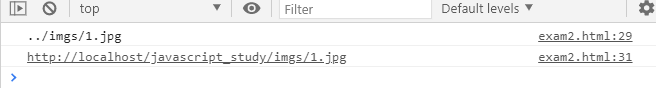
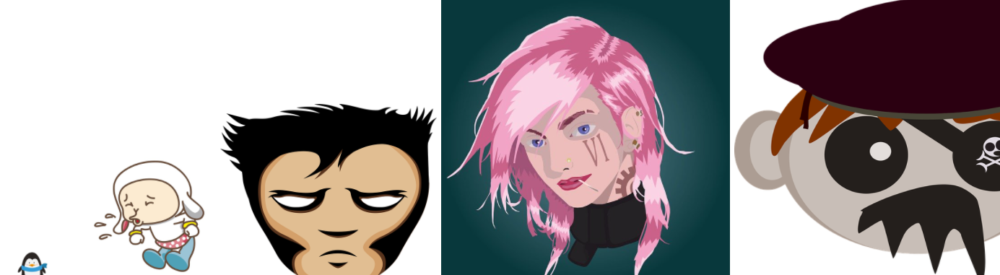
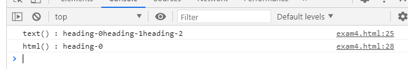
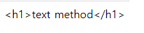
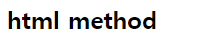
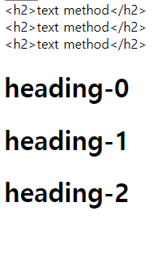
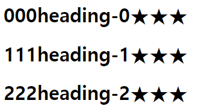
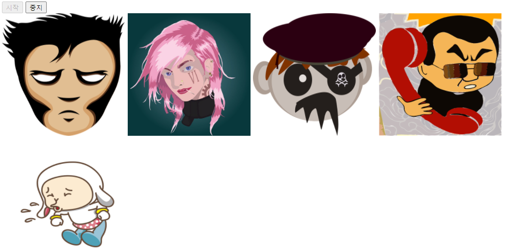
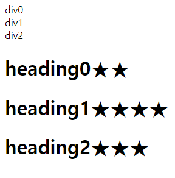

# jQuery
#### $('태그명[속성="값"]')
- $('태그명[속성^="값"]')	^은 시작값은 모두한다 라는뜻
- $('태그명[속성$="값"]')	$은 끝값이 그거여야 된다라는 뜻
- $('태그명[속성~="값"]')	~은 값을 포함하기만 하면 됨
```
$('input[type="button"]').on('click', () => {
	$('input[type="text"]').val('안녕~~');
	let str = $('input[type="text"]').val();
	console.log(str);
});
```
#### $('태그명:속성')
- $('태그명:first')    태그명의 첫번째 요소
- $('태그명:last')     태그명의 마지막 요소	
- $('태그명:odd')      태그명의 홀수번째 요소
- $('태그명:even')     태그명의 짝수번째 요소
```
$('input[type="button"]').on('click', () => {
    $('tbody > tr:odd').css('background-color', 'yellow');
	$('tbody > tr:even').css('background-color', 'green');
	$('tbody > tr:last').css('background-color', 'blue');
});
```
#### 속성을 다루는 함수 attr() prop()가 있다.
#### attr()는 웹 디자이너 관점에서 사용 prop()는 웹프로그래머 관점에서 사용한다.
```
let str = $('img').attr('src'); // getter
console.log(str);
```
```
let str1 = $('img').prop('src'); // getter
console.log(str1);
```

#### 여러그림의 인덱스를 받아 점점 커지게
```
$('img').css('width',	(index) => {
	return (index+1)*100+'px';
});
```

#### jQuery css속성 여러개 주는 방법 1, 2번 같은결과
1. 비추천
```
$('img').css('width',	'200px').css('height', '300px');
```
2. 추천
```
$('img').css({
	width:'200px',
	height: '300px'
});
```
#### html() VS text() 차이
```
let str = $('h1').text();
console.log('text() : ' + str);
		
str = $('h1').html();
console.log('html() : ' + str);
```

```
// <h1></h1>까지 내용 들어가짐
$('div').text('<h1>text method</h1>');
```

```
// <h1></h1>은 빼고 내용 들어가짐
$('div').html('<h2>html method</h2>');
```

#### * 모든 div 불러오는데 #app 빼고
```
$('div').not('#app').text('<h2>text method</h2>');
```

#### html 또는 text (index, oldHtml)
```
$('h1').html((index, oldHtml) => {
	return index + oldHtml + '★';
});
```

#### setInterval 함수 사용
```
let intervalId;
$('#btnStart').on('click', function () {
	// setInterval(함수정의, 밀리초)  1초 = 1000밀리초
	intervalId = setInterval(function () {
 		// $('div#app > img:first').appendTo('div#app');
		$('div#app > img').first().appendTo('div#app');
	}, 500);
	// 시작버튼이 this가 됨
	$(this).prop('disabled', true);
	$('#btnStop').prop('disabled', false);
});
	
$('#btnStop').on('click', function () {
	clearInterval(intervalId);
	// 중지버튼이 this가 됨
	$(this).prop('disabled', true);
	$('#btnStart').prop('disabled', false);
});
```

#### mouseover 함수 사용
#### 마우스가 올라갈때마다 ★이 생긴다. 
```
$('h1').not('div#app').on('mouseover', function () {
	$(this).append('★');
});
```
