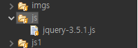
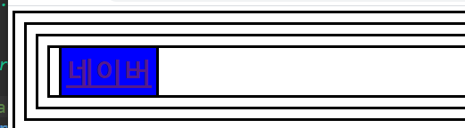
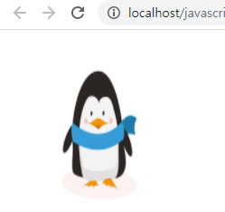
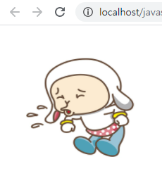
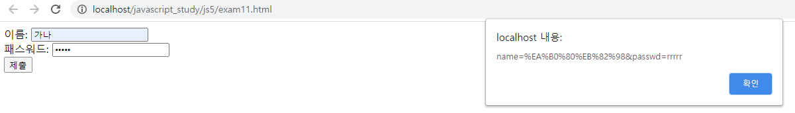
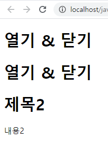

# jQuery
### jQuery적용하기
- 이미지처럼 넣기(jQuery홈페이지에서 다운로드)<br>

- 코드 넣기
```
<script src="../js/jquery-3.5.1.js"></script>
```
### [$('태그명[속성="값"]')](https://github.com/yunjinhyeong/javaEclipse/blob/master/javascript_study/WebContent/js5/exam3.html)
- $('태그명[속성^="값"]')	^은 시작값은 모두한다 라는뜻
- $('태그명[속성$="값"]')	$은 끝값이 그거여야 된다라는 뜻
- $('태그명[속성~="값"]')	~은 값을 포함하기만 하면 됨
```
$('input[type="button"]').on('click', () => {
	$('input[type="text"]').val('안녕~~');
	let str = $('input[type="text"]').val();
	console.log(str);
});
```
### [$('태그명:속성')](https://github.com/yunjinhyeong/javaEclipse/blob/master/javascript_study/WebContent/js5/exam3.html)
- $('태그명:first')    태그명의 첫번째 요소
- $('태그명:last')     태그명의 마지막 요소	
- $('태그명:odd')      태그명의 홀수번째 요소
- $('태그명:even')     태그명의 짝수번째 요소
```
$('input[type="button"]').on('click', () => {
    $('tbody > tr:odd').css('background-color', 'yellow');
	$('tbody > tr:even').css('background-color', 'green');
	$('tbody > tr:last').css('background-color', 'blue');
});
```
### 속성을 다루는 함수 attr() prop()가 있다.
### [attr()는 웹 디자이너 관점에서 사용 prop()는 웹프로그래머 관점에서 사용한다.](https://github.com/yunjinhyeong/javaEclipse/blob/master/javascript_study/WebContent/js5/exam2.html)
```
let str = $('img').attr('src'); // getter
console.log(str);
```
```
let str1 = $('img').prop('src'); // getter
console.log(str1);
```

### [여러그림의 인덱스를 받아 점점 커지게](https://github.com/yunjinhyeong/javaEclipse/blob/master/javascript_study/WebContent/js5/exam2.html)
```
$('img').css('width',	(index) => {
	return (index+1)*100+'px';
});
```

### [jQuery css속성 여러개 주는 방법 1, 2번 같은결과](https://github.com/yunjinhyeong/javaEclipse/blob/master/javascript_study/WebContent/js5/exam2.html)
1. 비추천
```
$('img').css('width',	'200px').css('height', '300px');
```
2. 추천
```
$('img').css({
	width:'200px',
	height: '300px'
});
```
### [html() VS text() 차이]((https://github.com/yunjinhyeong/javaEclipse/blob/master/javascript_study/WebContent/js5/exam4.html))
```
let str = $('h1').text();
console.log('text() : ' + str);
		
str = $('h1').html();
console.log('html() : ' + str);
```

```
// <h1></h1>까지 내용 들어가짐
$('div').text('<h1>text method</h1>');
```

```
// <h1></h1>은 빼고 내용 들어가짐
$('div').html('<h2>html method</h2>');
```

### [* 모든 div 불러오는데 #app 빼고](https://github.com/yunjinhyeong/javaEclipse/blob/master/javascript_study/WebContent/js5/exam4.html)
```
$('div').not('#app').text('<h2>text method</h2>');
```

### [html 또는 text (index, oldHtml)](https://github.com/yunjinhyeong/javaEclipse/blob/master/javascript_study/WebContent/js5/exam4.html)
```
$('h1').html((index, oldHtml) => {
	return index + oldHtml + '★';
});
```

### [SetInterval 함수 사용](https://github.com/yunjinhyeong/javaEclipse/blob/master/javascript_study/WebContent/js5/exam6.html)
```
let intervalId;
$('#btnStart').on('click', function () {
	// setInterval(함수정의, 밀리초)  1초 = 1000밀리초
	intervalId = setInterval(function () {
 		// $('div#app > img:first').appendTo('div#app');
		$('div#app > img').first().appendTo('div#app');
	}, 500);
	// 시작버튼이 this가 됨
	$(this).prop('disabled', true);
	$('#btnStop').prop('disabled', false);
});
	
$('#btnStop').on('click', function () {
	clearInterval(intervalId);
	// 중지버튼이 this가 됨
	$(this).prop('disabled', true);
	$('#btnStart').prop('disabled', false);
});
```

### mouseover 함수 사용
### [마우스가 올라갈때마다 ★이 생긴다.](https://github.com/yunjinhyeong/javaEclipse/blob/master/javascript_study/WebContent/js5/exam7.html)
```
$('h1').not('div#app').on('mouseover', function () {
	$(this).append('★');
});
```

### [이벤트전파 막기, 기본기능 막기](https://github.com/yunjinhyeong/javaEclipse/blob/master/javascript_study/WebContent/js5/exam9.html)
```
<script>
	// a  클릭   css()   background-color  blue
	$('a').on('click', function (e) {	// 선택한 h1을 중복쓰지말고 this로 선택 jQuery에서 JS는 event target으로 해야됨
		$(this).css('background-color','blue');
		
		// 현재 태그요소의 기본기능 막기(a태그는 하이퍼링크 기능 막기)
		e.preventDefault();
		// 이벤트 전파 막기 (태그가 포함관계로 겹쳐있을 경우)
		e.stopPropagation();
		return false; // 기본기능과 이벤트전파 모두 막기
	});
	// h1 클릭   css()   background-color  red
	$('h1').on('click', function () {	// 선택한 h1을 중복쓰지말고 this로 선택 jQuery에서 JS는 event target으로 해야됨
		$(this).css('background-color','red');
	});
</script>
```

### [mouseover, mouseout](https://github.com/yunjinhyeong/javaEclipse/blob/master/javascript_study/WebContent/js5/exam9.html)


```
<script>
	// 1번 방법 : 대상.mouseover(함수정의).mouseout(함수정의);
	$('img.img1').mouseover(function () {
		$(this).attr('src', '../imgs/2.jpg');
	}).mouseout(function () {
		$(this).attr('src', '../imgs/1.jpg');
	});

	// 2번 방법 : 대상.on({});
	$('img.img1').on({
		mouseover: function () {
			$(this).attr('src', '../imgs/2.jpg');
		},
		mouseout: function () {
			$(this).attr('src', '../imgs/1.jpg');
		}
	});
</script>
<style>
/* 방법 3 */
img.img1:hover {
	content: url("../imgs/2.jpg");
}
</style>
```
### [serialize() 쿼리 스트링으로 폼태그 안의 내용 가져오기](https://github.com/yunjinhyeong/javaEclipse/blob/master/javascript_study/WebContent/js5/exam11.html)
```
<script>
	$('#myForm').submit(function () {
		// 쿼리 스트링으로 폼태그 안의 내용 가져오기
		let str = $(this).serialize(); // 직렬화(데이터를 텍스트화)
		alert(str);
		
		// 하나하나 가져오기
		let name = $('#name').val().trim();
		let passwd = $('#passwd').val().trim();
		if (name == '' || passwd == '') {
			alert('이름과 패스워드 모두 입력하세요.');
			event.preventDefault(); // 현재 태그요소의 기본기능 막기
			//return false; // 현재 태그요소의 기본기능과 이벤트 전파를 모두 막는다.
			return;
		}
		alert('이름은 '+name+'\n패스워드는 '+passwd);
	});
</script>
```

### [제이쿼리 간단한 화면효과 함수 ex)toggle](https://github.com/yunjinhyeong/javaEclipse/blob/master/javascript_study/WebContent/js5/exam12.html)
```
<script>
	// 제이쿼리 간단한 화면효과 함수
	// show()        hide()      toggle()--> 나타나 있으면 안나타나게 안나타나있으면 나타나게
	// slideDown()   slideUp()   slideToggle()
	// fadeIn()      fadeOut()   fadeToggle()
	
	// 제이쿼리에서 현재태그요소 기준으로 다른 태그요소를 탐색하는 함수
	// next() 형제관계에서 바로 다음요소
	// prev() 형제관계에서 바로 이전요소
	// find() 포함하고 있는 자식 또는 자손요소를 찾기
	// closest() 자신을 포함하고 있는 부모 또는 조상요소를 찾기
	
	
	$('h1').click(function () {
		$(this).next().fadeToggle();
	});
</script>
```
