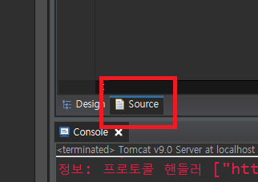

## WebContent-member
#### (1) [joinForm 코드](https://github.com/yunjinhyeong/javaEclipse/blob/master/jsp_study/WebContent/member/joinForm.jsp)
```
<body>
	<h1>회원가입</h1>
	<hr>
	<form action="joinProcess.jsp" method="post">
		아이디: <input type="text" name="id"><br>
		패스워드: <input type="password" name="passwd"><br>
		이름: <input type="text" name="name"><br>
		나이: <input type="number" name="age" min="0" max="200"><br>
		성별: <input type="radio" name="gender" value="남"> 남성
		      <input type="radio" name="gender" value="여"> 여성<br>
		이메일: <input type="email" name="email"><br>
		<input type="submit" value="회원가입">      
	</form>
</body>
```

#### (2) [joinProjess 코드(joinForm정보를 joinProjess로 받아들이기)](https://github.com/yunjinhyeong/javaEclipse/blob/master/jsp_study/WebContent/member/joinProcess.jsp)
- 맨 윗부분에 Dao, Vo사용을 위해 <%@page import="com.exam.vo.MemberVo"%> 와 <%@page import="com.exam.dao.MemberDao"%> 을 import먼저해준다.
- RegDate를 사용하기 위해 이어서 <%@page import="java.sql.Timestamp"%>도 import해준다.
```
<%
//post 파라미터값 한글처리
request.setCharacterEncoding("utf-8");

//VO객체 준비
MemberVo memberVo = new MemberVo();

//파라미터 찾기
memberVo.setId(request.getParameter("id"));
memberVo.setPasswd(request.getParameter("passwd"));
memberVo.setName(request.getParameter("name"));
memberVo.setAge(Integer.parseInt(request.getParameter("age")));
memberVo.setGender(request.getParameter("gender"));
memberVo.setEmail(request.getParameter("email"));

//회원가입(날짜시간) 정보 설정
memberVo.setRegDate(new Timestamp(System.currentTimeMillis()));

//DAO 객체 준비
MemberDao memberDao = new MemberDao();

//회원가입 처리 수행
memberDao.addMember(memberVo);
%>
```
#### * 위 코드에서 html관련 코드만 다 지우고 아래 script만 넣어 실행
```
<script>
	alert('회원가입 성공!');
	location.href = 'loginForm.jsp';
</script>
```
> loginForm.jsp으로 이동해 새로고침해도 안전하다.


#### (3) joinForm에 정보입력 후 joinProjess로 잘 받아들여지는지 workbench로 확인하기
- joinForm에 정보입력<br>

- joinProjess 입력결과<br>

- workbench로 확인<br>


#### (4) 회원들만 접근 가능한 페이지로 만드는 코드
```
<%
	// 세션값 가져오기
String id = (String)session.getAttribute("id");
// 세션값이 없으면 loginForm.jsp로 이동
if(id==null){
	%>
	<script>
		alert('로그인 후 접근 가능한 페이지 입니다.');
		location.href = 'loginForm.jsp';
	</script>
	<%
	return;
}
%>
```
#### (5) 로그아웃시 모든 세션 지우는 코드
```
<%
session.invalidate(); // 모든 세션 지우기
%>
```
#### (6) location.href VS // response.sendRedirect
> location.href 그냥 이동
> sendRedirect 가진 정보 전부 폐기처분
#### (7) JS에서 확인창 띄워 boolean값 받아오기
```
let isDelete = confirm('정말 탈퇴하시겠습니까?');
```
## WebContent - board
#### writeForm.jsp

#### IP 값 RegDate 값 저장하기
```
boardVo.setIp(request.getRemoteAddr());
boardVo.setRegDate(new Timestamp(System.currentTimeMillis()));
```
#### writeForm.jsp 에서 글쓰기 버튼 누르면 content.jsp로 넘어간다.
#### writeForm.jsp 에서 글목록 버튼 누르면 list.jsp로 넘어간다.

#### list.jsp [이전] 1~5 [다음] 코드
```
<%
	if(count>0) {
		// 전체 페이지 갯수 (전체/10)+(전체%10==0?0:1)  ex) 22
		int pageCount = (count/pageSize) + (count % pageSize == 0 ? 0 : 1 );
		// 한 화면에 보여줄 페이지버튼 갯수
		int pageBlock = 5;
		// (0)*5+1=1
		int startPage = ((pageNum / pageBlock) - (pageNum % pageBlock == 0 ? 1 : 0 )) * pageBlock + 1;
		// end = 4
		int endPage = startPage + pageBlock - 1;
		if(endPage > pageCount) {
			endPage = pageCount;
		}
		// [이전]
		if(startPage > pageBlock) {
			%>
			<a href="list.jsp?paegNum=<%=startPage - pageBlock %>">[이전]</a>
			<%
		}
		// 1~5 출력
		for(int i=startPage ; i<=endPage ; i++) {
			if(i == pageNum) {
				%>
				<a href="list.jsp?pageNum=<%=i%>" class="active">[<%=i %>]</a>
				<%
			} else {
				%>
				<a href="list.jsp?pageNum=<%=i%>">[<%=i %>]</a>
				<%
			}
		}
		// [다음]
		if(endPage < pageCount) {
			%>
			<a href="list.jsp?pageNum=<%=startPage + pageBlock%>">[다음]</a>
			<%
		}
	}
%>
```
#### list.jsp 에서 제목을 누르면 content.jsp로 넘어간다.

#### 삭제시 첨부파일도 삭제하는 코드
```
if (isPasswdOK) {
	// 글번호에 해당하는 글내용 가져오기(첨부파일 정보 확인 위해서)
	BoardVo boardVo = boardDao.getBoardByNum(num);
	String filename = boardVo.getFile();
	if (boardVo.getFile() != null) { // 첨부파일 있으면
		String realPath = application.getRealPath("/upload");
		File file = new File(realPath, filename);
		if(file.exists()) {
			file.delete();
		}
	}
```
#### Connection Pool 적용하는방법



```
<Context>
	<Resource
	 name="jdbc/jspdb"
	 auth="Container"
	 type="javax.sql.DataSource"
	 driverClassName="com.mysql.cj.jdbc.Driver"
	 url="jdbc:mysql://localhost:3306/jspdb?useUnicode=true&amp;characterEncoding=utf8&amp;allowPublicKeyRetrieval=true&amp;useSSL=false&amp;serverTimezone=Asia/Seoul"
	 username="myid"
	 password="mypwd"
	/>
</Context>
```
1. name="jdbc/jspdb" 은 /뒤에 DB스키마 이름을 쓰는게 관례다
2. type="javax.sql.DataSource" 이 책임지고 아래 driverClassName url 작업 수행
3. ※ XML 문장에서 &을 넣고 싶으면 &amp; 라고 쓴다 아님 빨간줄

