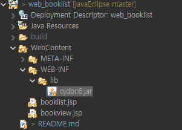
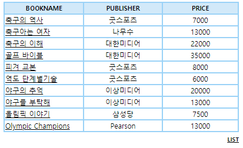

# 1. MySQL과 오라클 자바 연동 차이
## 자바와 MySQL과 연동
### (1) String dbUrl = "jdbc:mysql://localhost:3306/jspdb?useUnicode=true&characterEncoding=utf8&allowPublicKeyRetrieval=true&useSSL=false&serverTimezone=Asia/Seoul";
### (2) Class.forName("com.mysql.cj.jdbc.Driver");
### (3) Statement stmt = dbconn.createStatement();
## 자바와 오라클 연동("<% %>"안에 씀)
### (1) String url="jdbc:oracle:thin:@localhost:1521:XE";
### (2) Class.forName("oracle.jdbc.driver.OracleDriver");
### (3) Statement stmt = con.prepareStatement(sql);
# 2. 오라클 자바 연동시 넣는다

# 3. 결과화면
## booklist 결과

## listview 결과
